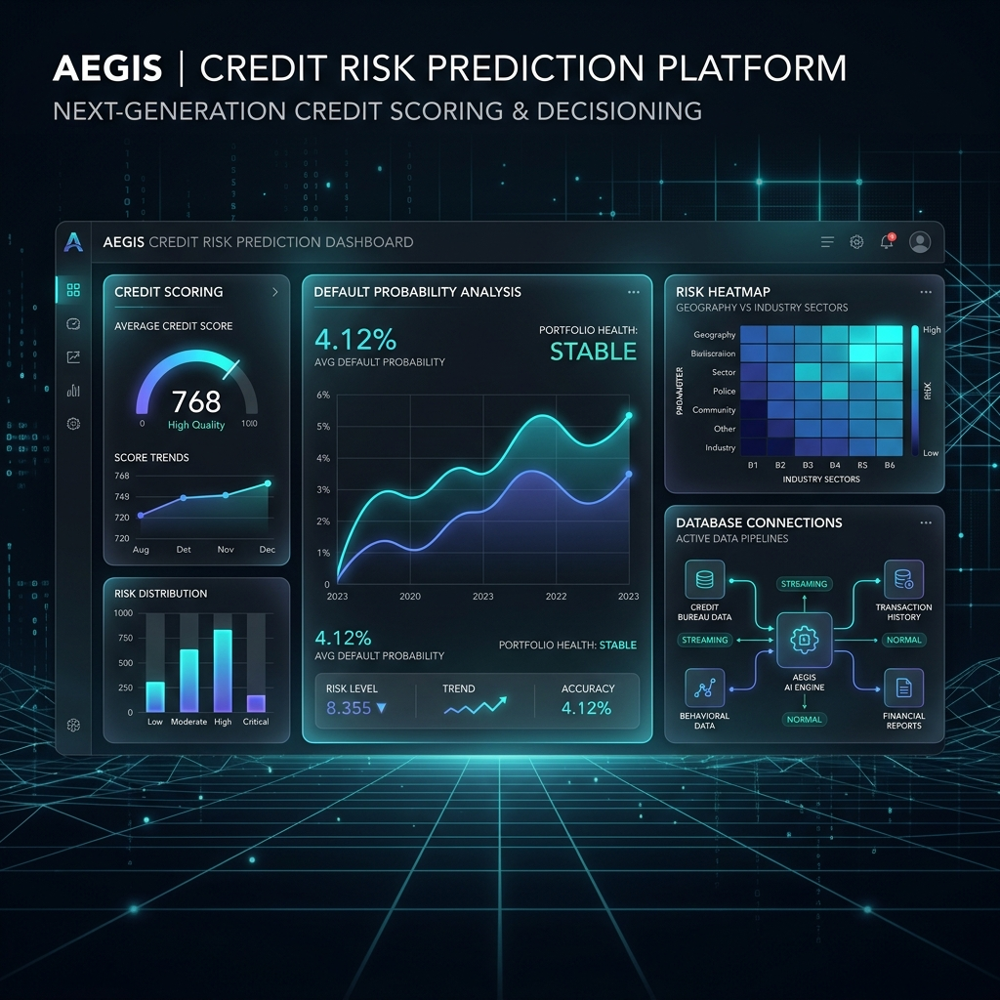
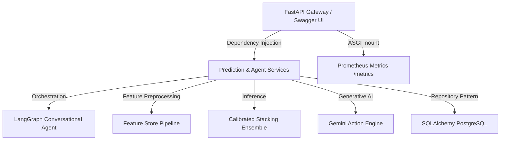

# Aegis Risk - Enterprise Customer Delinquency Prediction Platform



Aegis Risk is a bank-grade, end-to-end credit risk assessment and default prediction REST API built using Clean Architecture, SOLID design principles, and modern MLOps pipelines. 

---

## 🏛️ System Architecture

The platform is designed around strict dependency boundaries separating raw infrastructure from core business rules:



### Key Modules:
- **`backend/pipeline/feature_store.py`**: Computes rolling ratios (`Repayment_Score`, `Avg_Repayment`, `Payment_Stress`, `Utilization_DTI`), runs outlier screening via Isolation Forest, and generates Mutual Information rankings.
- **`backend/pipeline/model_factory.py`**: Trains custom stackings (`RandomForest` + `ExtraTrees` + `HistGradientBoosting`) and calibrates probabilities using Platt Scaling (Sigmoid) and Isotonic Regression.
- **`backend/pipeline/explainers.py`**: Performs local/global explainability (SHAP & LIME) and demographic parity fairness audits.
- **`backend/services/agent_service.py`**: LangGraph agent routing conversational queries (`Why is customer 105 high risk?`) through Prediction, SHAP, and Policy nodes.
- **`backend/database/`**: Implements SQLAlchemy ORM tracking customers, audit trails, and ML versions.

---

## 🚀 Getting Started (Local Development)

We provide a Docker Compose configuration to spin up the entire database, cache, API, and monitoring network locally.

### Prerequisites:
Make sure you have Docker and Docker Compose installed.

### Run Containers:
```bash
# 1. Start database, cache, FastAPI, and Prometheus services
docker-compose -f infrastructure/docker-compose.yml up --build -d

# 2. Train the machine learning model locally with permission checks
python backend/train_model.py
```

The system will initialize a PostgreSQL database, a Redis cache, mount a Prometheus exporter at `http://localhost:8000/metrics`, and start the FastAPI webserver at `http://localhost:8000`.

---

## 🔌 API Documentation

| Endpoint | Method | Role | Description |
| :--- | :--- | :--- | :--- |
| `/api/auth/token` | `POST` | Public | Generates OAuth2 JWT tokens for authentication. |
| `/api/predict` | `POST` | Analyst | Predicts default probability for a customer. |
| `/api/predict/batch` | `POST` | Analyst | Processes batch evaluations in background queues. |
| `/api/model/info` | `GET` | Analyst | Returns metadata of the active model. |
| `/api/model/shap` | `POST` | Analyst | Computes local SHAP explanation variables. |
| `/api/model/drift_report` | `GET` | Admin | Compares incoming data drift using Evidently AI. |
| `/api/agent/chat` | `POST` | Analyst | Conversation query endpoint for LangGraph risk agent. |
| `/health` | `GET` | Public | Standard health check endpoint. |

---

## 📈 Monitoring & Observability

- **Metrics Collection**: System metrics (latency, HTTP statuses, predictions distribution) are exposed via `/metrics` using Prometheus Client.
- **Drift Audits**: Evidently AI runs population stability audits comparing baseline reference datasets with prediction logs.
