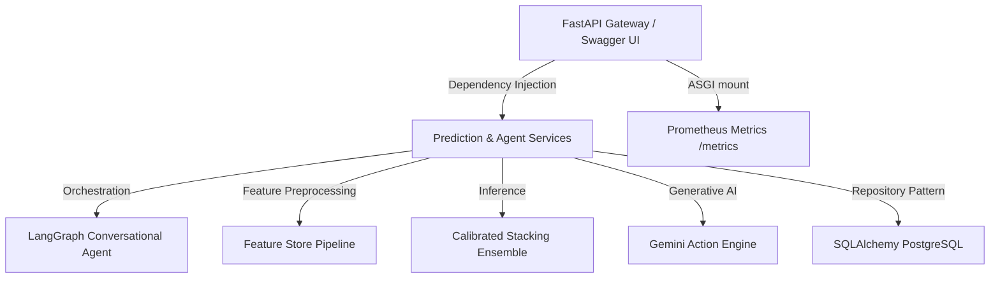

# Aegis Risk - Enterprise Credit Risk & Delinquency Prediction Platform

Aegis Risk is a production-grade, bank-compliant credit risk assessment and default prediction API service. Built with **FastAPI**, **SQLAlchemy/PostgreSQL**, and **LangGraph**, it showcases software engineering excellence through Clean Architecture, SOLID principles, cost-sensitive model thresholds, and robust MLOps observability.

🔗 **Live Production API**: [https://customer-delinquency-prediction.vercel.app](https://customer-delinquency-prediction.vercel.app)  
🚀 **Live API Health Status**: [https://customer-delinquency-prediction.vercel.app/health](https://customer-delinquency-prediction.vercel.app/health)

---

## 🏛️ System Architecture

The project adheres strictly to **Clean Architecture** patterns, separating raw database infrastructure from business logic, pipelines, and REST routing interfaces:



### 📂 Clean Directory Structure
* **`backend/api/`**: REST gateway routers (auth, predictions, SHAP, and conversational agent endpoints) protected by RBAC dependencies.
* **`backend/database/`**: Declarative database entities mapping Customers, logged Predictions, Audit Trails, and Model Versions.
* **`backend/repositories/`**: Decoupled CRUD operations following the Repository Pattern for clean database isolation.
* **`backend/pipeline/`**:
  * `feature_store.py`: Engineering pipeline calculating repayment trend vectors, stress indexes, and filtering outliers using Isolation Forest.
  * `model_factory.py`: Optuna-optimized stacking ensemble with probability calibration (Platt Scaling) and cost-sensitive threshold tuning.
  * `explainers.py`: Explainable AI (SHAP & LIME local attributes) and Demographic Parity auditing.
* **`backend/services/`**:
  * `predict_service.py`: Scoring engine logging input factors, predicting, and tracking execution metrics.
  * `agent_service.py`: Conversational agent compiled as a LangGraph StateGraph routing through predict, SHAP, policy limits, and Gemini synthesis nodes.

---

## 📈 Engineering Highlights & Business Impact

### 1. Cost-Sensitive Threshold Optimization
Standard models optimize for raw accuracy, which is highly dangerous in banking (where a False Negative/loan default costs significantly more than a False Positive/refusing credit). 
We implement a custom financial risk minimization threshold search:
$$\text{Cost} = (FN \times 5.0) + (FP \times 1.0)$$
This calibrates our classification threshold to minimize dollars-at-risk.

### 2. Calibrated Probability Estimates
To output reliable default probabilities, base estimators are wrapped in a `CalibratedClassifierCV` (using Platt Sigmoid Scaling and Isotonic Regression).

### 3. Serverless Optimization & Graceful Fallbacks
Configured to run in **Vercel Serverless Functions** under tight file sizes and runtime constraints:
* **SQLite Fallback**: Automatically redirects sqlite database queries to a writeable `/tmp/predictions.db` environment when running serverless.
* **Graceful explainability fallbacks**: Captures `ImportError` on heavy C-extensions like `shap`, defaulting to deterministic feature value heuristics.

---

## 🔌 Core REST API Endpoints

| Method | Endpoint | Role | Description |
| :--- | :--- | :--- | :--- |
| `POST` | `/api/auth/token` | Public | Obtains JWT tokens for role authentication. |
| `POST` | `/api/predict` | Analyst | Evaluates delinquency risk for a customer. |
| `POST` | `/api/predict/batch` | Analyst | Processes bulk predictions asynchronously. |
| `POST` | `/api/model/shap` | Analyst | Retrieves SHAP feature contributions. |
| `GET` | `/api/model/drift_report` | Admin | Compares incoming data drift using Evidently AI. |
| `POST` | `/api/agent/chat` | Analyst | Conversational LangGraph credit agent chat loop. |
| `GET` | `/health` | Public | Core service health metrics response. |

### 🧪 Sample Inference Request
```bash
curl -X POST "https://customer-delinquency-prediction.vercel.app/api/predict?customer_id=12345" \
     -H "Authorization: Bearer admin-token-secret" \
     -H "Content-Type: application/json" \
     -d '{
       "Age": 35,
       "Income": 60000.0,
       "Credit_Score": 700.0,
       "Loan_Balance": 15000.0,
       "Debt_to_Income_Ratio": 0.35,
       "Credit_Utilization": 0.45,
       "Missed_Payments": 0,
       "Employment_Status": "employed"
     }'
```

---

## 🚀 How to Run & Train (Local Development)

### 1. Local Containerized Orchestration
Deploy the PostgreSQL, Redis cache, and Prometheus exporter system locally:
```bash
docker-compose -f infrastructure/docker-compose.yml up --build -d
```

### 2. Model Training Execution
Run the automated model tuning and training script:
```bash
python backend/train_model.py
```
*(In a non-interactive Docker or CI/CD environment, the script automatically bypasses confirmation prompts and dumps the pickled model pipeline directly to the `models/` directory).*
